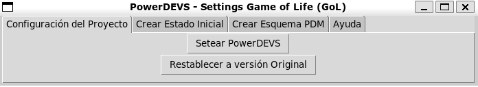
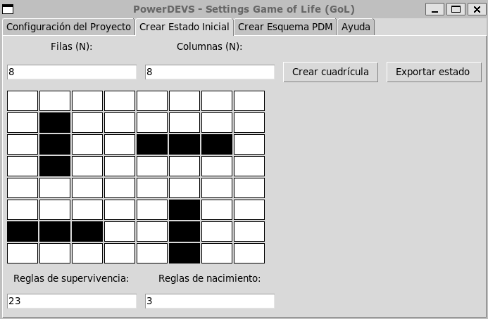
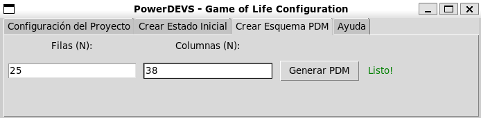

# Simulación del Juego de la Vida en PowerDEVS

Este proyecto fue desarrollado en el marco de la entrega final para la materia "Simulación". Consiste en la implementación del famoso "Juego de la Vida" de Conway utilizando PowerDEVS, un entorno de simulación de eventos discretos. 


## Preparación del Entorno / Dependencias

Para este proyecto, se requiere lo siguiente:

- [Python >= 3.7](https://www.python.org/downloads/)
- [pip](https://pip.pypa.io/en/stable/installation/)
- [PillowWriter](https://pypi.org/project/PillowWriter/) (para generar gifs)
- [PowerDEVS](https://sourceforge.net/projects/powerdevs/)
```bash
python --version
pip --version
```

## Instalación de Dependencias del Proyecto:

El archivo `requirements.txt` contiene todas las dependencias específicas del proyecto. Para instalarlas, ejecuta el siguiente comando:

```bash
pip install -r requirements.txt
```

## Estructura del Proyecto

La estructura del proyecto es la siguiente:

- `assets/`: Contiene imágenes y gifs de diferentes simulaciones/patrones.
- `atomics/`: Modelos atómicos de PowerDEVS para el proyecto.
- `examples/`: Incluye modelos PDM con distintas configuraciones de tableros listos para ser ejecutados.
- `lib/`: Contiene gol.dpl y assets que constituyen la biblioteca del proyecto.
- `patterns/`: Archivos .txt categorizados, que representan diferentes patrones para el juego.
- `report.pdf`: Reporte del proyecto, especificación DEVS, experimentos e instrucciones de uso para la herramienta de configuración 'Settings GoL' en el anexo.
- `gen_template.py`: Script para generar esquemas PDM de tamaño NxM listos para ser ejecutados.
- `gui.py` Script que permite configurar el proyecto de manera visual (GUI).
- `plotter.py` Script que permite generar animaciones a partir de un archivo de salida.
- `build.sh` Script para construir el proyecto de manera automática.
- `restore.sh` Script para revertir PowerDEVS a su estado previo a la instalación del proyecto (útil para desinstalar el proyecto).


## Configuración del Entorno

El primer paso es clonar este proyecto en su directorio raiz de PowerDevs 
```
git clone https://github.com/BrendaDichiara/tpgol.git
```

Para preparar PowerDEVS necesitarás configurarlo. Para facilitar este proceso, proporcionamos el script build.sh. Asegúrate de tener los permisos necesarios para ejecutarlo. Si no, puedes hacerlo de la siguiente manera:
```bash
chmod +x build.sh

./build.sh
```
El script realiza por usted (entre otras cosas) las siguientes configuraciones:
- Incorpora la libreria del proyecto a PowerDEVS, la misma tiene el nombre de "Game of Life" en la misma se encuentran los modelos atómicos, asi como también ejemplos de tableros de tamaños NxM (3x3),(5x5),(8x8) listos para ser ejecutados.
- Incorpora los modelos atómicos cell, mediator así como utilidades necesarias.
- Crea una carpeta patterns en la raiz de PowerDEVS que contiene patrones de ejemplo listos para ser cargados en la simulación que usted desee.
- Añade una carpeta examples que contiene modelos PDM de ejemplo listos para ser ejecutados.

Si por algun motivo desea desinstalar el proyecto, se provee un script que permite volver PowerDEVS a su estado previo a la instalación del mismo, para ello:

```bash
chmod +x restore.sh

./restore.sh
```
Este proceso también puede ser realizado de manera gráfica utilizando el script `gui.py`


---


## Uso 

### Estado Inicial
El estado inicial del juego se establece a partir de un archivo .txt. En la carpeta "patterns" del directorio raíz de PowerDEVS encontrarás varios patrones en formato .txt que puedes usar.

Formato:
```
<cantidad de filas>
<cantidad de columnas>
<tablero inicial (0 muerto, 1 vivo)>
<reglas de supervivencia>
<reglas de nacimiento>
```

Por ejemplo, un blinker en un 3x3 se vería de la siguiente manera:

```
3
3
0 1 0
0 1 0
0 1 0
23
3
```

Puesto que la creación de patrones en este formato puede ser un proceso laborioso, especialmente para tableros de grandes dimensiones, para crear patrones de manera visual y exportarlos en el formato correcto, puedes usar la herramienta de configuración 'Settings GoL'.



Nota: Para más información sobre la herramienta de ayuda, se provee una guía de uso en el anexo del reporte.

### Visualización.

El modelo atómico Mediator en su segundo parámetro recibe el nombre del archivo de salida, el mismo se guarda en la carpeta raiz de PowerDevs/output/nombreArchivoSalida.log, el cual cuenta con el siguiente formato:

```
MEDIATOR: Tablero
<tablero> 1

MEDIATOR: Tablero
<tablero> 2
.
.
.
```

Si bien es posible leer el tablero en el registro mismo que se guarda en output/,  para una mejor visualización se provee el script `plotter.py` que permite generar un gif a partir del archivo de salida con matplotlib, para ello se utiliza el siguiente comando:

```bash
python plotter.py -i <archivo a plotear> -o <nombre del archivo de salida>
```
Nota: los parámetros -i y -o son requeridos.


## Tableros de gran tamaño, conexiones, esquemas PDM

Crear las conexiones entre células y mediator es todo un desafio a medida que el tablero crece en dimensiones. Para facilitar este proceso, la herramienta visual proporciona una funcionalidad que permite generar automáticamente esquemas PDM de dimensiones NxM con las conexiones necesarias.

Ingrese las dimensiones deseadas en los campos de texto proporcionados y haga clic en el botón "Generar PDM". La herramienta generará automáticamente un archivo PDM con un esquema de las dimensiones especificadas.




## Reporte

En el archivo 'report.pdf'  encontrarás un análisis detallado de los experimentos más interesantes llevados a cabo durante este proyecto, así como también la especificación DEVS de los modelos y su implementación en PowerDEVS, en el anexo del mismo se encuentra la guía de uso para la herramienta de configuración 'Settings GoL'.


